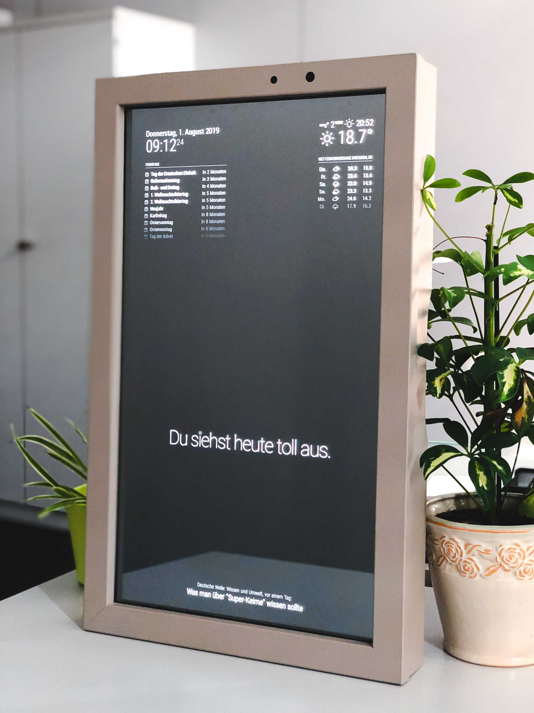

# Projects

## Kresse auf dem Mars (with Camera Time Lapse)

<https://www.raspberrypi.com/news/raspberry-pi-zero-waters-your-plants-and-records-growth-timelapse/>

OR

See [Arduino Projects](../arduino/projects.md/#kresse-auf-dem-mars) for a similar project without the camera and no time-lapse.

## [RetroPie](https://retropie.org.uk/)

We would recommend to use the pre-made image, but if you want to install it manually, you can follow the instructions on the official website.

[Pre-made image](https://retropie.org.uk/download/)

[Manuel install](https://retropie.org.uk/docs/Manual-Installation/)

## [Smart Mirror](https://www.smart-mirror.net/)

A smart mirror is a two-way mirror with an electronic display behind the glass. The display can show the viewer different kinds of information in the form of widgets, such as weather, time, date, and news updates.

{: .image-medium}

[Tutorial](https://www.raspberrypi.com/tutorials/how-to-build-a-super-slim-smart-mirror/)

## Own Alexa

[Tutorial](https://developer.amazon.com/en-US/docs/alexa/alexa-smart-screen-sdk/raspberry-pi.html)

## [Pet Plant](https://www.raspberrypi.com/news/turn-your-houseplant-into-a-pet/)

## [WordClock](https://www.raspberrypi.com/news/das-wordclock/)

[Writeup](https://rpi-wordclock.readthedocs.io/en/latest/index.html)

[Code](https://github.com/bk1285/rpi_wordclock)

## List of projects

[Awesome Raspberry Pi](https://github.com/thibmaek/awesome-raspberry-pi?tab=readme-ov-file#projects)

##

- Rapsberry Pi Physical Computing
- IO Broker
- Wordpress
