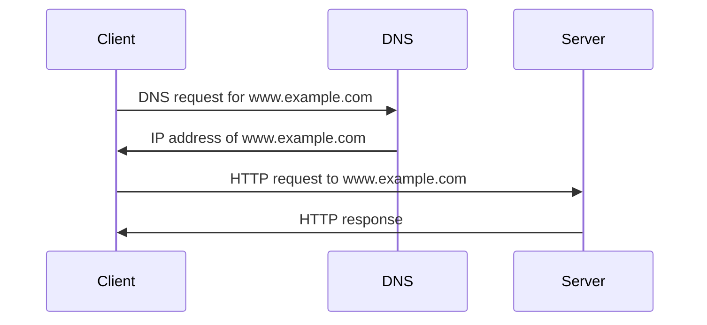

# Sequence of events

How does a client connect to a server?

<!-- SequenceDiagram with DNS and simple HTTP ca^l -->

```mermaid
sequenceDiagram
    participant Client
    participant DNS
    participant Server

    Client->>DNS: DNS request for www.example.com
    DNS->>Client: IP address of www.example.com
    Client->>Server: HTTP request to www.example.com
    Server->>Client: HTTP response
```
