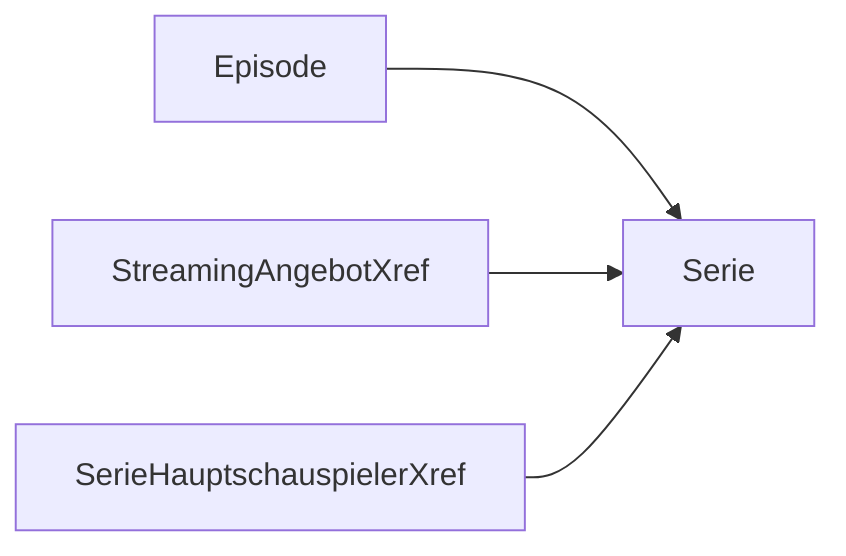

# Playground

Best UI for Database: [DBeaver](https://dbeaver.io/download/)

## Create your first database

### Setup the Database

You can create an easy database when using the `H2 Embedded` database.

1. Install DBeaver
2. Create a new connection
3. Choose `H2 Embedded`
4. Click `create` and choose a location for your database
5. Click `finish`

### Create the tables

Download the [create-files](../../../assets/data/db/create.sql){:download="create.sql"} and execute them in DBeaver (You can execute them by opening a new SQL Editor and copy the content of the file into the editor and execute it).

### Insert data

Download the [insert-files](../../../assets/data/db/insert.sql){:download="insert.sql"} and execute them in DBeaver.

## SQL

### Basics

1. Serie mit "a" im Namen

```sql
select * from serie s where s.serienname like '%a%';
```

2. Sender, welche ein Fernsehprogramm haben

```sql
select distinct se.sendername from sender se inner join ausstrahlung a on a.sender_pk = se.sender_pk;
```

3. Sender, mit Fernsehprogramm nach 17:30

```sql
select se.sendername from sender se inner join ausstrahlung a on a.sender_pk = se.sender_pk where CAST(a.startzeit as time) > '17:30:00' and CAST(a.startzeit as time) > '17:30:00';
```

4. Serie bei denen Aaron Paul mitspielt

```sql
select s.serienname from serie s
inner join seriehauptschauspielerxref s2 on s2.serie_fk = s.serie_pk
inner join kunstler k on k.kuenstler_pk = s2.kuenstler_fk
where k.vorname = 'Aaron' and k.nachname = 'Paul';
```

5. Summer der Verträge von Peter Feldmann

```sql
select sum(v.monatspreis) from vertrag v inner join kunde k on k.email = v.email_fk where k.vorname = 'Peter' and k.nachname = 'Feldmann';
```

6 staffeln nach avg rating

```sql
select s.serienname, e.staffel, avg(e.imdb_rating)
 from serie s inner join episode e on e.serie_pk = s.serie_pk group by e.staffel, s.serienname  order by avg(e.imdb_rating) desc;
```

7. Serien, die aktuell nicht im TV ausgestrahlt werden

```sql
select s.serienname from serie s where s.serienname not in (select distinct s.serienname from serie s inner join ausstrahlung a on a.serie_pk = s.serie_pk);
```

8. Stoffentwickler = Künstler

```sql
select * from serie s inner join seriehauptschauspielerxref s2 ON s.kuenstler_fk = s2.kuenstler_fk;
```

9. Schauspieler mit mehreren Serien

```sql
select k.vorname, k.nachname, count(s2.serie_fk) from kunstler k inner join seriehauptschauspielerxref s2 on s2.kuenstler_fk = k.kuenstler_pk group by k.vorname, k.nachname having count(s2.serie_fk) > 1;
```

10. Rating diff pro Episode in Staffel

```sql
select s.serienname, e.staffel, e.episode_pk, (e.imdb_rating - e2.imdb_rating) as rating_diff from episode e inner join episode e2 on e2.episode_pk  = e.episode_pk - 1 and e2.staffel = e.staffel and e2.serie_pk = e.serie_pk inner join serie s on s.serie_pk = e.serie_pk order by s.serienname, e.staffel, e.episode_pk;
```

### Referential Integrity

A referential integrity constraint is a rule that maintains the defined relationship between two tables when records are inserted, updated, or deleted in the database.

#### 1. Add a broadcast of S3E1 for the series "Lupin" on ZDF

`Serie Luping = 3, ZDF = 2, Staffel 3, Episode 1`

```sql
insert into ausstrahlung
(serie_pk, episode_pk, Staffel, sender_pk, Ausstahlungsnummer, Startzeit, Endzeit) values
(3, 1, 3, 2, 7, '2020-01-01 20:15:00', '2020-01-01 21:15:00');
```

Error:

```
ERROR: insert or update on table "ausstrahlung" violates foreign key constraint "fk_ausstrah_associati_episode"
Detail: Key (serie_pk, episode_pk, staffel)=(3, 1, 3) is not present in table "episode".
```

> **Explanation:** There is no episode 1 in season 3 of Lupin

<br>

#### 2. Change the creator of "The Orville" to the person number 99.

```sql
update serie set kuenstler_fk = 99 where serie_pk = 2;
```

Error:

```
ERROR: insert or update on table "serie" violates foreign key constraint "fk_serie_associati_kunstler"
Detail: Key (kuenstler_fk)=(99) is not present in table "kunstler".
```

> **Explanation:** There is no artist with the ID 99

<br>

#### 3. Delete the series "Breaking Bad"

```sql
delete from serie where serie_pk = 1;
```

Error:

```
ERROR: update or delete on table "serie" violates foreign key constraint "fk_episode_associati_serie" on table "episode"
Detail: Key (serie_pk)=(1) is still referenced from table "episode".
```

> **Explanation:** There are still episodes of Breaking Bad that reference the series

### Dependencies


