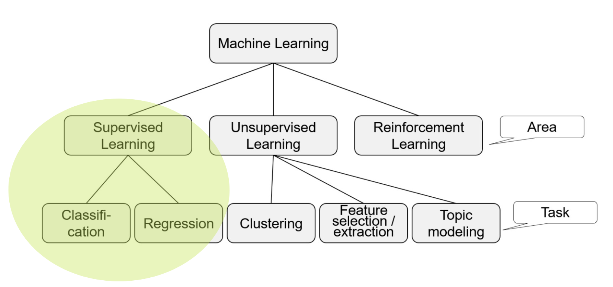

# Simple ML

We will use some Kaggle Competitions to get started with Machine Learning. The following are some simple starting points for Machine Learning:

## MNIST

<https://www.mt-itsolutions.com/kuenstliche-intelligenz/erste-schritte-mit-pytorch/>
<https://www.itsonix.eu/blog/2023-machine-learning-eine-kurze-einfuehrung-mit-python>

### Fashion Mnist (Zalando)

<https://github.com/zalandoresearch/fashion-mnist>

## The Movie Database (TMDb) Box Office Prediction

<https://www.kaggle.com/competitions/tmdb-box-office-prediction>

## Titanic: Machine Learning from Disaster

<https://www.kaggle.com/competitions/titanic>

### With R-Studio

<https://trevorstephens.com/kaggle-titanic-tutorial/getting-started-with-r/>

## House Prices: Advanced Regression Techniques

<https://www.kaggle.com/competitions/house-prices-advanced-regression-techniques>

## ML HDA

### Beer Consumption

<https://www.kaggle.com/datasets/dongeorge/beer-consumption-sao-paulo>

Challenge 1:

The file beer_consumption.csv contains information about the weather, day and
beer consumption per day in Sao Paulo. The aim is to predict the beer consumption
(in liters) based on the remaining information. Complete the following tasks in a
Jupyter Notebook named challenge1.ipynb:
a. Do a short exploratory data analysis to see what information is given and what
basic properties the data has.
b. Split the data randomly into 80% (292 days) to train a linear model and 20%
(73 days) to calculate the MSE of the trained model on “new” data.
c. Improve the model through feature engineering, e.g. by ignoring some
features or creating new ones.

Challenge 2:
Complete the following tasks in a Jupyter Notebook named
optional_challenge1.ipynb:
a. Load the beer consumption data from Sao Paulo (beer_consumption.csv) and
split it into 80% training and 20% test data. (Better: use a 5-fold cross
validation).
b. Train different linear models (LinearRegression, Lasso, RidgeRegression,
ElasticNet) to predict the beer consumption based on the given data.
c. Find the best model by tuning hyperparameters and feature engineering (e.g.
ignoring some features or creating new ones).

### Phoneme

<https://www.kaggle.com/datasets/timrie/phoneme>
Input: Recordings of 5 phonemes
(given as log-periodogram)
• Output: Phoneme („aa“, „ao“,
„dcl“, „iy“, „sh“)
• Dataset: Log-periodogram and
phoneme of 4509 recordings
• Aim: Predict phoneme based on
log-periodogram

The file phoneme.csv contains recordings of phonemes (as log-periodogram) and a
corresponding label of the phoneme. The aim is to predict the phoneme based on
its log-periodogram. Complete the following tasks in a Jupyter Notebook named
optional_challenge2.ipynb:
a. Do an exploratory data analysis to see what information is given and what
basic properties the data has.
b. Use a 5-fold cross validation to find an optimal classifier by:
• Training different classification models
• Tuning hyperparameters of the models
• Feature engineering

### Tecator

<https://www.openml.org/search?type=data&id=505&sort=runs&status=active>

Based on the Tecator dataset, a classification problem can be defined. We define
meat samples with a fat content of ≤ 20% as “low-fat” and with > 20% as “highfat”. The aim is to classify a meat sample as low-/high-fat based on its absorbance
spectrum. Create a Jupyter Notebook named challenge2.ipynb to solve the
following task.
Find an optimal classifier by
• Training different classification models
• Tuning hyperparameters of the models
• Feature engineering
Use 5-fold cross validation to estimate the accuracy.
The aim is to define a classifier with an accuracy > 95%. It is possible to achieve >
99% with feature engineering and a simple model.

## Step-by-Step Guide

<https://machinelearningmastery.com/machine-learning-in-python-step-by-step/>
