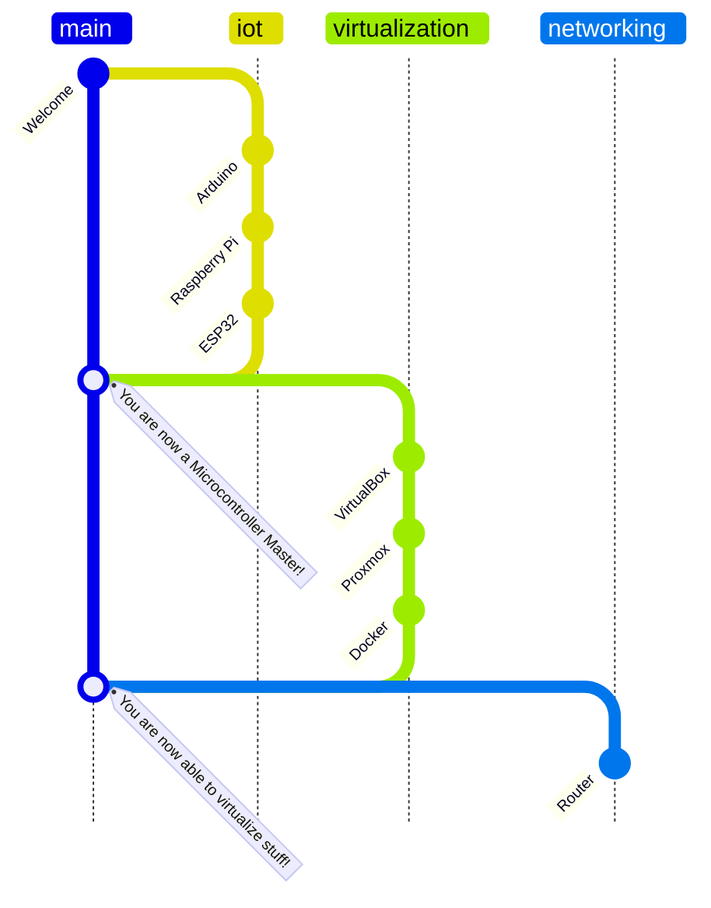

# Welcome, new trainee!

This is a documentation to learn the basics as an FiSi trainee.

## Granularity

This documentation should just be a rough overview of the topics. It should not be too detailed, because you should learn to find information yourself. You should also learn to ask the right questions or Google the right keywords.

!!! note

    All subjects in this docu are already covered somewhere in the internet. I dont wont to reinvent the wheel. I just want to give you a rough overview and some links to get started.

## Structure

[timeline(docs/timeline.json)]

!!! note

    There are some further topics in the navigation bar, but they are not essential for the trainee project.

## Main topics

- First, we will do a few projects with [IoT Boards](1_iot/index.md), like the Raspberry Pi, to get familiar with some basic hardware.
- After that, we will setup some [virtual machines](2_virtualization/index.md) to a basic infrastructure.
- Then we will setup a [network](3_networking/index.md) with a router and real switches.
  - We will also setup some servers and services to get a infrastructure like a company would have (e.g. a webserver, a mailserver, a fileserver, ...)
- Lastly, you can choose some other topics like [coding](7_coding/index.md) or [AI](8_ai/index.md). These are not essential for the trainee project, but you can learn a lot from them.

## Prepare yourself

- Get familiar with the [Linux command line](https://www2.icp.uni-stuttgart.de/~icp/mediawiki/images/b/bd/Sim_Meth_I_T0_cheat_sheet_10_11.pdf)

Some other useful tools:

- [jq](https://jqlang.github.io/jq/)
- Built-in:

  - [grep](https://www.gnu.org/software/grep/)
  - [sed](https://www.gnu.org/software/sed/)
  - [awk](https://www.gnu.org/software/gawk/manual/gawk.html)

- jdew
  - cehcbj

<?quiz?>

question: Are you ready?
answer-correct: Yes!
answer: No!
content:

<h4> Great! </h4>
<?/quiz?>
