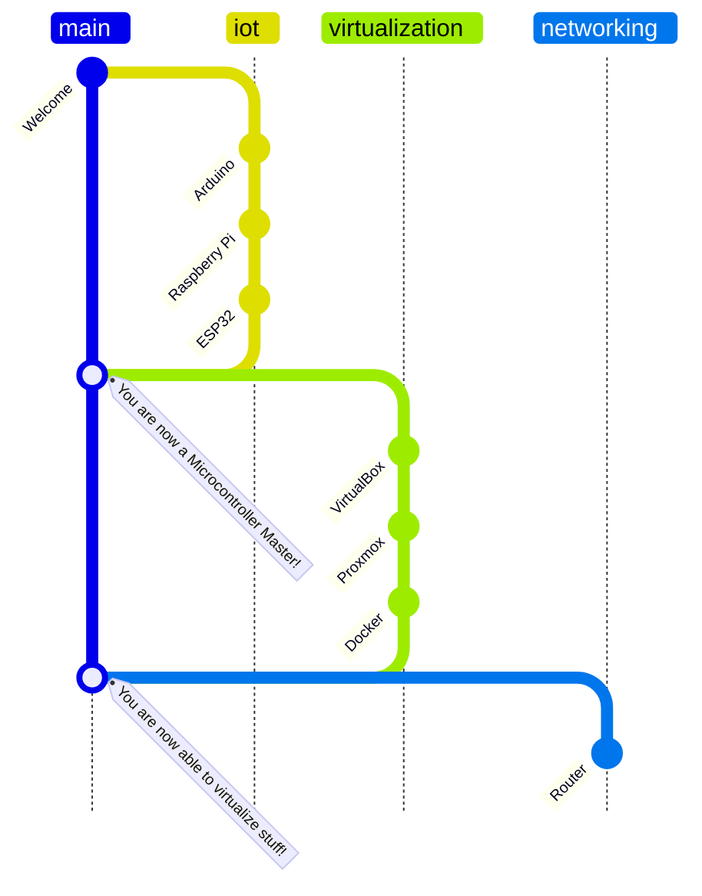

# Welcome, new trainee!

This is a documentation to learn the basics as an FiSi trainee.

## Granularity

This documentation should just be a rough overview of the topics. It should not be too detailed, because you should learn to find information yourself. You should also learn to ask the right questions or Google the right keywords.

!!! note

    All subjects in this docu are already covered somewhere in the internet. I dont wont to reinvent the wheel. I just want to give you a rough overview and some links to get started.

## Structure

[timeline(docs/timeline.json)]

!!! note

    There are some further topics in the navigation bar, but they are not essential for the trainee project.

## Main topics

- First, we will do a few projects with [IoT Boards](10_iot/index.md), like the Raspberry Pi, to get familiar with some basic hardware.
- After that, we will setup some [virtual machines](20_virtualization/index.md) to a basic infrastructure.
- Then we will setup a [network](30_networking/index.md) with a router and real switches.
  - We will also setup some servers and services to get a infrastructure like a company would have (e.g. a webserver, a mailserver, a fileserver, ...)
- Lastly, you can choose some other topics like [coding](70_coding/index.md) or [AI](80_ai/index.md). These are not essential for the trainee project, but you can learn a lot from them.

## Prepare yourself

- Get familiar with the [Linux command line](https://www2.icp.uni-stuttgart.de/~icp/mediawiki/images/b/bd/Sim_Meth_I_T0_cheat_sheet_10_11.pdf)

Some other useful tools (but not essential) are:

- [jq](https://jqlang.github.io/jq/)
- Built-in:

  - [grep](https://www.gnu.org/software/grep/)
  - [sed](https://www.gnu.org/software/sed/)
  - [awk](https://www.gnu.org/software/gawk/manual/gawk.html)

<?quiz?>

question: Are you ready?
answer-correct: Yes!
answer: No!
content:

<h4> Great! </h4>
<?/quiz?>

## Further topics

### Training Framework Plan (Ausbildungsrahmenplan)

Here is a list of all important topics, you should know at the end of your training.

| Nr       | Richt                                           | Grob                                                                                                                                                                         | Fein |
| -------- | ----------------------------------------------- | ---------------------------------------------------------------------------------------------------------------------------------------------------------------------------- | ---- |
| 3.1      | Informieren und Kommunizieren                   |                                                                                                                                                                              |      |
| 3.1 e    |                                                 | Daten und Sachverhalte visualisieren und Grafiken erstellen sowie Standardsoftware anwenden                                                                                  |      |
| 3.3      | Teamarbeit                                      |                                                                                                                                                                              |      |
| 4.2      | Systemarchitektur, Hardware und Betriebssysteme |                                                                                                                                                                              |      |
| 4.2 a    |                                                 | Sys und Hardware Architekturen kennen. Speicher und Peripherie Kompatibilität                                                                                                |      |
| 4.2 b    |                                                 | BS Komponenten und deren Anwendungsbereiche                                                                                                                                  |      |
| 4.3      | Anwendungssoftware                              |                                                                                                                                                                              |      |
| 4.3 a-c  |                                                 | Software kennen. HW + Systemvorraussetzungen beurteilen. Leistung + Erweiterung prüfen                                                                                       |      |
| 4.4      | Netze, Dienste                                  |                                                                                                                                                                              |      |
| 4.4 a    |                                                 | HW+SW zur Datenübertragung unterscheiden                                                                                                                                     |      |
| 4.4 b    |                                                 | Netzwerkarchitekturen unterscheiden                                                                                                                                          |      |
| 4.4 c    |                                                 | Netzwerkbetriebssysteme (NOS) beurteilen. (diese Regeln zb die Druckerfreigaben. -> zb Windows NT)                                                                           |      |
| 5.1      | Ist-Analyse und Konzeption                      |                                                                                                                                                                              |      |
| 5.1 a    |                                                 | HW+SW für einen Arbeitsplatz ermitteln. Arbeitsablauf, Datenflüsse und Schnittstellen analysieren.                                                                           |      |
| 5.1 c    |                                                 | HW+SW Komponenten auswählen und Lösungsvarianten entwickeln                                                                                                                  |      |
| 5.1 d    |                                                 | Datenmodelle entwerfen (UML???)                                                                                                                                              |      |
| 5.1 e    |                                                 | DOKU                                                                                                                                                                         |      |
| 5.2      | Programmiertechniken                            |                                                                                                                                                                              |      |
| 5.2 a    |                                                 | prozedurale vs objektorientiert unterscheiden                                                                                                                                |      |
| 5.2 b    |                                                 | Programmierlogik und Programmiermethoden anwenden                                                                                                                            |      |
| 5.2 c    |                                                 | Anwendung erstellen (klein)                                                                                                                                                  |      |
| 5.3      | Installieren und Konfigurieren                  |                                                                                                                                                                              |      |
| 5.3 a    |                                                 | Systeme zusammenstellen und verbinden                                                                                                                                        |      |
| 5.3 b    |                                                 | HW und Betriebssysteme installieren und konfigurieren                                                                                                                        |      |
| 5.3 c    |                                                 | Standardsoftware (Office etc) installieren und konfigurieren                                                                                                                 |      |
| 5.3 d    |                                                 | Systeme testen                                                                                                                                                               |      |
| 5.3 e    |                                                 | Konfig-Files festhalten und Systemdokus erstellen                                                                                                                            |      |
| 5.4      | Datenschutz und Urheberrecht                    |                                                                                                                                                                              |      |
| 5.4 a    |                                                 | Verschlüsselungsverfahren und Zugriffsschutzmethoden anwenden                                                                                                                |      |
| 5.4 e    |                                                 | Daten archivieren, nicht mehr benötigte Datenbestände löschen, Datenträger entsorgen                                                                                         |      |
| 5.5      | Systempflege                                    |                                                                                                                                                                              |      |
| 5.5 a-c  |                                                 | Datenbanken                                                                                                                                                                  |      |
| 5.5 e+f  |                                                 | Backup + Wiederherstellung                                                                                                                                                   |      |
| 6.1      | Analyse und Design                              |                                                                                                                                                                              |      |
| 6.1 a-e  |                                                 | OOAD                                                                                                                                                                         |      |
| 6.2      | Programmerstellung und -dokumentation           |                                                                                                                                                                              |      |
| 6.2 a    |                                                 | Programmiersprache                                                                                                                                                           |      |
| 6.2 b    |                                                 | Dev-Environment                                                                                                                                                              |      |
| 6.2 d    |                                                 | Modulare Programmierung                                                                                                                                                      |      |
| 6.2 f    |                                                 | Konfigurationsmanagement                                                                                                                                                     |      |
| 6.3      | Schnittstellenkonzepte                          |                                                                                                                                                                              |      |
| 6.3 a+b  |                                                 | Schnittstellen (REST?)                                                                                                                                                       |      |
| 6.4      | Testverfahren                                   |                                                                                                                                                                              |      |
| 6.4 a-d  |                                                 | Testing                                                                                                                                                                      |      |
| 7        | Schulung                                        |                                                                                                                                                                              |      |
| 7 a-e    |                                                 | Schulungsziele und -methoden festlegen. Schulungsveranstaltungen organisatorisch vorbereiten                                                                                 |      |
| 8.1      | Systemkonfiguration                             |                                                                                                                                                                              |      |
| 8.1 a    |                                                 | Rechner- und Systemarchitekturen sowie Betriebssysteme beurteilen und einordnen                                                                                              |      |
| 8.1 b    |                                                 | BS nach Vor und Nachteilen auswählen                                                                                                                                         |      |
| 8.1 c    |                                                 | BS Steuersprachen anwenden                                                                                                                                                   |      |
| 8.1 d    |                                                 | Speichermedien, Systemkomponenten und Einund Ausgabegeräte auswählen                                                                                                         |      |
| 8.1 e    |                                                 | Hardwarekomponenten hard- und softwareseitig einstellen                                                                                                                      |      |
| 8.1 f    |                                                 | Kompatibilität von Systemkomponenten beurteilen und Probleme lösen                                                                                                           |      |
| 8.1 g    |                                                 | HW + SW in bestehende Systeme integrieren                                                                                                                                    |      |
| 8.2      | Netzwerke                                       |                                                                                                                                                                              |      |
| 8.2 a    |                                                 | Vor und Nachteilen von: Netzwerk-Topologien, Protokollen und Schnittstellen                                                                                                  |      |
| 8.2 b    |                                                 | Netzwerkbetriebssysteme installieren und konfigurieren                                                                                                                       |      |
| 8.2 c    |                                                 | Übergänge zwischen Netzwerken                                                                                                                                                |      |
| 8.2 d    |                                                 | Softwarearchtitekturen in Netze integrieren                                                                                                                                  |      |
| 8.3      | Systemlösungen                                  |                                                                                                                                                                              |      |
| 8.3 a-c  |                                                 | SW + HW + Programme nach Kundenanforderungen auswählen, installieren und konfigurieren                                                                                       |      |
| 8.3 d    |                                                 | Workflows erstellen                                                                                                                                                          |      |
| 8.3 e    |                                                 | Zugriffsrechte verwalten                                                                                                                                                     |      |
| 8.3 g    |                                                 | Leistungsfähigkeit von Systemen der Informationsund Telekommunikationstechnik ermitteln, beurteilen und optimieren                                                           |      |
| 8.4      | Einführung von Systemen                         |                                                                                                                                                                              |      |
| 8.4 a    |                                                 | Dokumentationen                                                                                                                                                              |      |
| 8.4 b    |                                                 | Systemeinführung planen und organisieren                                                                                                                                     |      |
| 8.4 c    |                                                 | Datenübernahmen planen und durchführen                                                                                                                                       |      |
| 8.4 e    |                                                 | Systemkomponenten aus integrierten Systemen entfernen                                                                                                                        |      |
| 9.1      | Benutzerunterstützung                           |                                                                                                                                                                              |      |
| 9.1 a    |                                                 | Anwendungsmöglichkeiten, Leistungsspektrum und Bedienung komplexer Systeme vor Benutzern präsentieren                                                                        |      |
| 9.1 b    |                                                 | Bedienungsunterlagen und Hilfe-Programme zur Benutzerunterstützung bereitstellen sowie Systeme zur interaktiven Benutzerunterstützung einrichten                             |      |
| 9.1 c    |                                                 | Benutzerprobleme analysieren und lösen                                                                                                                                       |      |
| 9.2      | Fehleranalyse + Störungsbeseitigung             |                                                                                                                                                                              |      |
| 9.2 a    |                                                 | Fehler systematisch lösen                                                                                                                                                    |      |
| 9.2 b    |                                                 | Datenrettung                                                                                                                                                                 |      |
| 9.2 c    |                                                 | Fehlervermeidungsmaßnahmen planen                                                                                                                                            |      |
| 9.3      | Systemunterstützung                             |                                                                                                                                                                              |      |
| 9.3 a    |                                                 | Nutzungsrichtlinien erstellen. Für: Lizenzen, Zugriffsberechtigungen, Archivierung + Backup, Notfallmaßnahmen                                                                |      |
| 9.3 b    |                                                 | HW + SW etc beschaffen                                                                                                                                                       |      |
| 9.3 c    |                                                 | Systemkapazitäten planen                                                                                                                                                     |      |
| 9.3 d    |                                                 | Pflege und Verwaltung von Datenbeständen                                                                                                                                     |      |
| 9.3 e    |                                                 | Zugangsvoraussetzungen für die Nutzung externer Datenbanken und Informations- und Telekommunikationssysteme herstellen                                                       |      |
| 10.1     | Produkte, Prozesse und Verfahren                |                                                                                                                                                                              |      |
| 10.1 a-b |                                                 | für das Einsatzgebiet typischen Produkte, Prozesse und Verfahren im Hinblick auf die Anforderungen an komplexe Systemlösungen analysieren und in ein Lösungskonzept umsetzen |      |
| 10.1 d   |                                                 | vorhandene Systemlösungen im Einsatzgebiet erfassen und nach Maßgabe ihrer Leistungsfähigkeit, Funktionalität, Wirtschaftlichkeit und Erweiterbarkeit bewerten               |      |
| 10.2     | Projektplanung                                  |                                                                                                                                                                              |      |
| 10.2 a   |                                                 | Projektplanung: Personalplanung, Sachmittelplanung, Terminplanung und Kostenplanung                                                                                          |      |
| 10.2 b   |                                                 | Systemkonzeptionen und Projektplanungswerkzeuge anwenden                                                                                                                     |      |
| 10.3     | Projektdurchführung                             |                                                                                                                                                                              |      |
| 10.3 a-c |                                                 | Projekte mit Kunden, internen Stellen und externen Dienstleistern                                                                                                            |      |
| 10.3 d-e |                                                 | Abnahmeprotokolle                                                                                                                                                            |      |
| 10.4     | Projektkontroller + Qualitätsmanagenet          |                                                                                                                                                                              |      |
| 10.4 a   |                                                 | Soll-Ist-Vergleich                                                                                                                                                           |      |
| 10.4 b   |                                                 | Qualitätsmanagement                                                                                                                                                          |      |
| 10.4 c   |                                                 | Testläufe                                                                                                                                                                    |      |
| 10.4 d   |                                                 | Kunde bei Störungen informieren                                                                                                                                              |      |
| 10.4 e   |                                                 | Leistungen abrechnen, Nachkalkulation durchführen, abrechnungsrelevante Daten dokumentieren                                                                                  |      |
