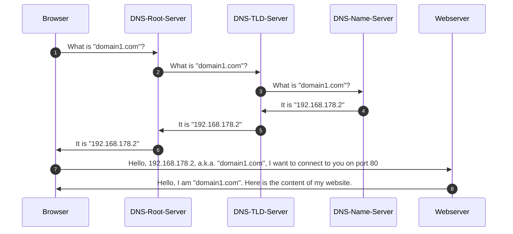

# Introduction

In this section, we will setup some basic services and learn how to connect to them.

In advance a few words about **how the internet works**.

## Sequence of events

How does a client connect to a server?

### Client wants to connect to `www.example.com`

1. Client asks DNS server for IP address of `www.example.com`
2. DNS server responds with IP address (e.g. `192.168.178.2`)
3. Client connects to `192.168.178.2` on port 80 (HTTP)

### Client wants to connect to `www.example.com:8080`

1. Client asks DNS server for IP address of `www.example.com`
2. DNS server responds with IP address (e.g. `192.168.178.2`) **Same as before**
3. Client connects to `192.168.178.2` on port 8080

### Client wants to connect to `www.example.com` via **`SMB`** (port 445)

> SMB: Protocol for file sharing

1. Client asks DNS server for IP address of `example.com`
2. DNS server responds with IP address (e.g. `192.168.178.2`) **Same as before** (DNS does not care about ports)
3. Client connects to `192.168.178.2` on port 445 (SMB)

!!! note

    DNS does not care about ports

## How does a server know which service to use?

How can we have a server, having multiple services running on it, and still be able to connect to the right service?

Assumption:

- We have a server and want to have 2 Webserver running on it
- We want to connect to the right Webserver depending on the domain name (`domain1.com` or `domain2.com`)

We can use **Virtual Hosts** to achieve this.

### Virtual Hosts

- We can have multiple virtual hosts on one server
- Each virtual host has its own domain name
- Each virtual host has its own document root (folder where the files are stored)

```conf
server { # domain1
    listen       80;
    server_name  domain1.com;


    location / {
      root   /var/www/html/domain1.com;
      index  index.html index.htm;
    }
  }

  server { # domain2
    listen       80;
    server_name  domain2.com;

    location / {
      root  /var/www/html/domain2.com;
        index  index.html index.htm;
    }
  }
```

Here we have 2 virtual hosts, each with its own domain name and document root.
Both listen on port 80, but they serve different content depending on the domain name.


