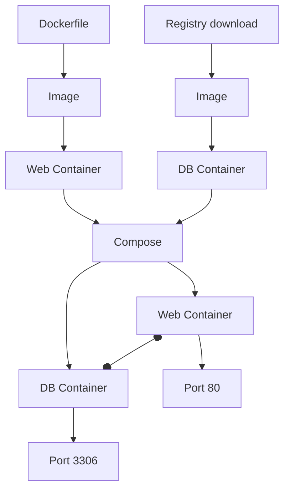

# Docker

Docker is a tool to run applications in containers. A container is a lightweight virtual machine. It is a virtual machine because it is isolated from the host system. It is lightweight because it does not need a full operating system. Instead, it uses the host system's kernel. This makes it very fast and efficient. Docker is a tool to manage containers. It is also used by many developers to run their applications locally.


!!! warning

    The running containers are ephemeral. This means that all data in the container is lost when the container is stopped. To persist data, you can map a [volume](#volumes) from the host to the container.

## How it works

The applications run in so-called `containers`. These containers be descendend from `images`. `Images` are the blueprints for `containers`. These images get generated from `Dockerfiles`, which are the blueprints for `images`.
You can create your own `Dockerfiles` to create your own `images` to run your own `containers`.

There are also pre-made `images` available on [Docker Hub](https://hub.docker.com/). These `images` are created by the community and can be used by everyone.

When you run a `container` from a pre-made image, it will be downloaded from the `Registry` (e.g. Docker Hub) and run on your machine. The `Registry` is a place where `images` are stored. You can also create your own `Registry` to store your own `images` or upload your own `images` to Docker Hub.

You can define multiple `containers` in a `docker-compose.yml` file. This way, you can run multiple `containers` at once.
Then you can also create dependencies between the `containers`. For example, you can create a `container` for a database and a `container` for a web server. Then you create a dependency between them, so that the web server `container` will only start when the database `container` is running.



## Getting Started

You can run Docker on your local machine (via [Docker Desktop](#docker-desktop)) or on a server (via [CLI](#cli)).

You can find a tutorial on how to get started with Docker [here](https://docs.docker.com/get-started/).

### Docker Desktop

Docker Desktop is the easiest way to get started with Docker. It is available for Windows and macOS. You can download it [here](https://docs.docker.com/get-docker/).

### CLI

If you want to run Docker on a server, you can use it via the CLI[^1]. You can install it on Ubuntu with the following command:

```bash
sudo apt install docker.io
```

## Host to Container mapping

When running a container, you can map ports and volumes from the host to the container.

Its always in the format `<host>:<container>`. For example, if you want to map port 8080 on the host to port 80 in the container, you would use `8080:80`.

### Ports

For example you want to run `docker run -p 8080:80 <image>`. This means that you want to run a container from the image `<image>` and map port 80 in the container to port 8080 on the host. This means that you can access the container via `localhost:8080`.

That means you can run multiple containers (e.g. 4 web servers) on the same host, but map them to different ports (e.g. 8080, 8081, 8082, 8083). This way, you can access all of them via the different port (e.g. `localhost:8080`, `localhost:8081`, `localhost:8082`, `localhost:8083`

```bash
docker run -p 8080:80 nginx
docker run -p 8081:80 nginx
docker run -p 8082:80 nginx
docker run -p 8083:80 nginx
```

### Volumes

As you might know, containers are ephemeral. This means that all data in the container is lost when the container is stopped. To persist data, you can map a volume from the host to the container.

You can also use this to inject data into the container. For example, you can map a volume from the host to the container and put a file in it. This way, the file will be available in the container.

#### Example

```bash
docker run -v /some/content:/usr/share/nginx/html -d nginx
```

In this example, the content of `/some/content` on the host will be available in the container at `/usr/share/nginx/html`.

So when you create a file `/some/content/index.html` with the content `Hello World!`, you can access it in the container at `localhost:8080/index.html`.

## Dockerfile

```dockerfile
FROM ubuntu:latest
```

## Docker Compose

Docker Compose is a tool to run multiple containers at once. You can define all containers in a `docker-compose.yml` file. You can find a tutorial on how to get started with Docker Compose [here](https://docs.docker.com/compose/gettingstarted/).

## Commands

Some basic commands to get started with Docker:

### Container Infos

```bash
docker ps # List running containers
docker ps -a # List all containers (also stopped/failed ones)
docker logs <container> # Show logs of a container (useful for debugging)
```

### Run

```bash
docker run <image> # Run a container
docker run -it <image> # Run a container and open a shell
docker run -d <image> # Run a container in the background
docker run -p <host-port>:<container-port> <image> # Run a container and map a port
docker run -v <host-path>:<container-path> <image> # Run a container and map a volume
```

### Stop

```bash
docker stop <container> # Stop a container
docker stop $(docker ps -a -q) # Stop all containers
```

### Remove

```bash
docker rm <container> # Remove a container
docker rm $(docker ps -a -q) # Remove all containers
```

### Prune

Docker stores all images and containers on the host. This can take up a lot of space. To free up space, you can use the `prune` command.

```bash
docker system prune # Remove all stopped containers, all dangling images, and all unused networks
docker system prune -a # Remove all stopped containers, all unused images, and all unused networks
docker system prune -a --volumes # Remove all stopped containers, all unused images, all unused networks, and all unused volumes
```

### Compose

```bash
docker-compose up # Run all containers defined in docker-compose.yml
docker-compose up -d # Run all containers defined in docker-compose.yml in the background
docker-compose down # Stop all containers defined in docker-compose.yml
docker-compose down -v # Stop all containers defined in docker-compose.yml and remove all volumes

docker-compose logs # Show logs of all containers defined in docker-compose.yml
docker-compose logs <container> # Show logs of a container defined in docker-compose.yml
docker-compose logs -f # Show logs of all containers defined in docker-compose.yml and follow the output
```

## Networking

Please watch the following video to learn more about Docker networking:

[Docker Networking](https://youtu.be/aMRDZ6Le1Zg){.youtube}

## Full Tutorial

You can find a full tutorial on how to get started with Docker [here](https://docs.docker.com/compose/gettingstarted/).

## IT-Lab Collection

Refer to our [Docker-Collection](https://github.com/ITLab-CC/Docker-Collection) for a collection of Dockerfiles and docker-compose files.

[^1]: CLI = Command Line Interface => Terminal
